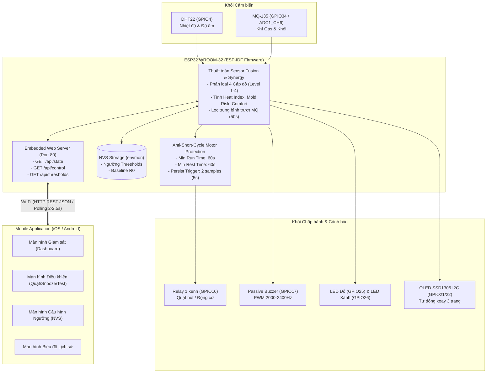

# TÀI LIỆU ĐẶC TẢ YÊU CẦU PHẦN MỀM MOBILE APP (MOBILE APP REQUIREMENTS SPECIFICATION)

## Dự án: Hệ Thống Giám Sát Môi Trường IoT (IoT-Based Environment Monitoring) — Nhóm 4 (IOT102)
**Hệ thống nhúng tham chiếu:** ESP-IDF Firmware trên vi điều khiển ESP32 WROOM-32 (30-pin)  
**Phiên bản tài liệu:** 2.0 (Đã chuẩn hóa đồng bộ 100% theo Source Code và README.md của Firmware)  
**Ngày cập nhật:** 27/09/2026  

---

## 1. Tổng quan Dự án & Bối cảnh Kỹ thuật

Hệ thống **IoT-Based Environment Monitoring** là giải pháp giám sát chất lượng vi khí hậu và an toàn môi trường trong nhà toàn diện. Hệ thống kết hợp thu thập dữ liệu thời gian thực từ cảm biến nhiệt độ - độ ẩm cao cấp (DHT22) và cảm biến chất lượng không khí/khí độc (MQ-135), tự động tính toán các chỉ số sinh thái và sức khỏe phái sinh (**Heat Index, Mold Risk Index, Thermal Comfort Level**), phân loại môi trường thành **4 cấp độ an toàn** (Normal, Notice, Warning, Critical) bằng thuật toán hợp nhất dữ liệu đa cảm biến (Multi-Sensor Fusion & Synergy Escalation).

Hệ thống sở hữu hai giao diện trực quan song song (**Dual-Interface Visualization**):
1. **Giao diện phần cứng tại chỗ (Physical Interface):** Màn hình OLED SSD1306 0.96 inch I2C (tự động luân chuyển 3 trang thông tin mỗi 5 giây), hệ thống đèn LED trạng thái (Xanh/Đỏ), còi báo động thông minh (Passive Buzzer PWM), nút nhấn vật lý đa năng (Short/Long/Very Long Press).
2. **Giao diện Mobile App từ xa (Remote Mobile Interface):** Cung cấp khả năng giám sát trực quan các thông số thời gian thực, điều khiển cơ cấu chấp hành (Quạt hút / Relay) với cơ chế bảo vệ động cơ thông minh (Anti-Short-Cycle), tạm dừng cảnh báo (Snooze), kích hoạt tự kiểm tra (Hardware Self-Test), hiệu chuẩn cảm biến khí gas ($R_0$ Calibration), và cấu hình ngưỡng kích hoạt lưu trực tiếp vào bộ nhớ flash Non-Volatile Storage (NVS) của vi điều khiển.



---

## 2. Ma trận Quy chuẩn Cảnh báo & Thuật toán Tính toán (Firmware Ground Truth)

Toàn bộ các quy tắc, ngưỡng kích hoạt, công thức toán học và cơ chế trễ (hysteresis) đã được lập trình cố định trong firmware ESP-IDF (`main/main.c`). Mobile App cần tuân thủ nghiêm ngặt các quy chuẩn sau:

### 2.1. Bảng 4 Cấp độ Phân loại Môi trường (Environmental Classification)

Firmware phân loại môi trường thành 4 mức hoạt động (`env_level_t`):

| Cấp độ | Tên mức (`env_level_str`) | Điều kiện Nhiệt độ (°C) | Điều kiện Độ ẩm (%RH) | Tỷ số Khí Gas ($K = R_s/R_0$) | Chỉ thị LED Phần cứng | Còi Buzzer Phần cứng | Hành vi Quạt hút (Relay) |
| :---: | :---: | :---: | :---: | :---: | :---: | :---: | :---: |
| **Mức 1** | **NORMAL** (Bình thường) | $25.0 \le T \le 29.0$ | $50 \le H \le 70$ | $K \ge 0.85$ (Không khí sạch) | **LED Xanh BẬT sáng đứng**<br>LED Đỏ TẮT | TẮT hoàn toàn | **TẮT** (Standby) |
| **Mức 2** | **NOTICE** (Chú ý) | $23.0 \le T < 25.0$ hoặc $29.0 < T \le 31.0$ | $40 \le H < 50$ hoặc $70 < H \le 75$ | $0.65 \le K < 0.85$ (Bắt đầu ô nhiễm) | **LED Xanh nhấp nháy**<br>(Chu kỳ 1s: 500ms ON / 500ms OFF)<br>LED Đỏ TẮT | TẮT hoàn toàn | **TẮT** (Trừ khi kích hoạt quy tắc cộng hưởng Synergy) |
| **Mức 3** | **WARNING** (Cảnh báo) | $21.0 \le T < 23.0$ hoặc $31.0 < T \le 33.0$ | $30 \le H < 40$ hoặc $75 < H \le 85$ | $0.45 \le K < 0.65$ (Khí xấu/Bí bách) | **LED Xanh & Đỏ nhấp nháy xen kẽ**<br>(Chu kỳ 800ms: 400ms Xanh / 400ms Đỏ) | TẮT hoàn toàn | **BẬT QUẠT** (Sau 2 mẫu liên tiếp = 5s; **TẮT/Standby** nếu nhiệt độ hoặc độ ẩm đang ở ngưỡng dưới) |
| **Mức 4** | **CRITICAL** (Nguy cấp) | $T < 21.0$ hoặc $T > 33.0$ | $H < 30$ hoặc $H > 85$ | $K < 0.45$ (Khí độc nguy hiểm / Khói) | **LED Đỏ chớp nhanh**<br>(Chu kỳ 700ms: 350ms ON / 350ms OFF)<br>LED Xanh TẮT | **BÍP 2400 Hz ngắt quãng đồng bộ với LED Đỏ**<br>*(CHỈ kêu khi Gas ở Mức 4; Silent khi chỉ nóng/ẩm)* | **BẬT QUẠT NGAY LẬP TỨC**<br>(**TẮT/Standby** nếu nhiệt độ hoặc độ ẩm đang ở ngưỡng dưới) |

> [!IMPORTANT]
> **Logic Còi Buzzer & Quạt Thông minh:** Để tránh gây ô nhiễm tiếng ồn và làm phiền sinh hoạt khi nhiệt độ/độ ẩm ngoài ngưỡng lý tưởng, còi buzzer **chỉ phát âm thanh cảnh báo khi và chỉ khi nồng độ Khí Gas (MQ-135) chạm Mức 4 (Nguy cấp)** (`mq_level >= 4`). Đồng thời, ở cả Mức 3 và Mức 4, nếu nguyên nhân rơi vào **ngưỡng dưới** (Lạnh: $<23^\circ\text{C}$ / $<21^\circ\text{C}$; Khô: $<40\%$ / $<30\%$), **quạt sẽ KHÔNG BẬT** để tránh làm không gian lạnh và khô thêm. Quạt chỉ tự động bật khi do ngưỡng trên (nóng, ẩm ướt) hoặc khí gas độc hại.

### 2.2. Cơ chế Chống dao động ngưỡng (Hysteresis)

Khi môi trường phục hồi từ mức nguy hiểm về mức an toàn hơn, firmware áp dụng khoảng trễ (hysteresis) để ngăn chặn hiện tượng dao động lặp (relay chatter / UI flickering):
- **Độ trễ Nhiệt độ (`TEMP_HYSTERESIS_C`):** $0.6^\circ\text{C}$. Ví dụ: Từ Mức 4 phục hồi về Mức 3 cần $T \le 33.0 - 0.6 = 32.4^\circ\text{C}$ (ngưỡng trên) hoặc $T \ge 21.0 + 0.6 = 21.6^\circ\text{C}$ (ngưỡng dưới).
- **Độ trễ Độ ẩm (`HUM_HYSTERESIS_PCT`):** $3.0\%\text{RH}$. Ví dụ: Từ Mức 4 phục hồi về Mức 3 cần $H \le 85.0 - 3.0 = 82.0\%$ hoặc $H \ge 30.0 + 3.0 = 33.0\%$.
- **Độ trễ Tỷ số Khí $K$:** $0.02$. Ví dụ: Từ Mức 4 phục hồi về Mức 3 cần $K \ge 0.45 + 0.02 = 0.47$.

### 2.3. Thuật toán Hợp nhất Đa Cảm biến & Leo thang Nguy cơ (Sensor Fusion & Synergy)

Cấp độ toàn cục của hệ thống (`env_level`) được tính toán thông qua hàm `evaluate_combined_env_level()`:
1. **Cấp độ cơ sở (Base Level):** $\max(\text{Temp Level}, \text{Hum Level}, \text{MQ Level})$.
2. **Quy tắc Cộng hưởng A (Synergy Rule A - Không khí bí bách/nóng ẩm):**
   Nếu toàn bộ hệ thống đang ở Mức 2 (Notice), nhưng:
   - Cả 3 cảm biến (Nhiệt độ, Độ ẩm, Khí gas) đều cùng chạm Mức 2, **HOẶC**
   - Có từ 2 cảm biến chạm Mức 2 trong đó **bắt buộc có cảm biến Khí gas (MQ-135)**,
   $\rightarrow$ Hệ thống tự động leo thang cảnh báo lên **Mức 3 (WARNING)** và khởi động quạt thông gió để giải tỏa ngột ngạt.
3. **Quy tắc Cộng hưởng B (Synergy Rule B - Nguy cơ kép / Compound Hazards):**
   - Nếu có từ **2 cảm biến bất kỳ đồng thời chạm Mức 3 (Warning)**,
   $\rightarrow$ Hệ thống tự động leo thang cảnh báo lên mức cao nhất: **Mức 4 (CRITICAL)**.

### 2.4. Thuật toán Bảo vệ Động cơ & Rơ-le (Anti-Short-Cycle Fan Control)

- **Khóa Ngăn Quạt ở Ngưỡng Dưới (Lower-Threshold Fan Inhibit):**
  Ở Mức 3 (Warning) và Mức 4 (Critical), quạt **KHÔNG BẬT** nếu nhiệt độ (hoặc độ ẩm hoặc cả hai) đang ở ngưỡng dưới (Lạnh: $<23^\circ\text{C}$ / $<21^\circ\text{C}$; Khô: $<40\%$ / $<30\%$) để tránh làm không gian lạnh hoặc khô hơn. Quạt chỉ tự động kích hoạt khi có nhiệt độ cao (nóng), độ ẩm cao (nồm ẩm/nấm mốc) hoặc nồng độ khí gas nguy hại.
- **Thời gian chạy tối thiểu (`FAN_MIN_RUN_TIME_MS`):** $60.000\text{ ms}$ (60 giây). Khi quạt đã tự động bật, quạt bắt buộc phải chạy tối thiểu 60s trước khi được phép tắt, ngay cả khi cảm biến đã báo môi trường về Mức 1.
- **Thời gian nghỉ tối thiểu (`FAN_MIN_REST_TIME_MS`):** $60.000\text{ ms}$ (60 giây). Khi quạt đã tắt, quạt bắt buộc phải nghỉ đủ 60s trước khi được phép khởi động lại.
- **Khóa bảo vệ (`fan_locked` & `fan_protect_rem_s`):** Firmware liên tục tính toán cờ khóa bảo vệ và số giây đếm ngược còn lại. Mobile App phải hiển thị thông tin này để người dùng không thắc mắc vì sao quạt chưa đổi trạng thái ngay.
- **Xác nhận bền vững (`FAN_TRIGGER_PERSIST`):** Tại Mức 3 (Warning), điều kiện bất lợi phải kéo dài liên tục qua 2 chu kỳ đo (tương đương 5 giây) quạt mới bật (nếu không rơi vào ngưỡng dưới). Tại Mức 4 (Critical), quạt kích hoạt lập tức (nếu không rơi vào ngưỡng dưới).
- **Ưu tiên can thiệp khẩn cấp (Emergency User Override):** Lệnh Snooze hoặc nút tắt thủ công từ app/nút bấm sẽ **ngay lập tức ngắt quạt và còi** mà không cần đợi hết thời gian khóa bảo vệ.

### 2.5. Các Công thức Tính toán Chỉ số Sức khỏe (Firmware tính sẵn)

Mobile App **không cần tính toán thủ công**, chỉ cần hiển thị trực tiếp các trường dữ liệu do ESP32 cung cấp:

1. **Chỉ số Nhiệt (Heat Index - $^\circ\text{C}$):**
   Tính theo phương trình hồi quy đa biến Rothfusz (chuẩn Cục Khí quyển và Đại dương Quốc gia Hoa Kỳ - NOAA):
   - Đổi $T_C$ sang $T_F = T_C \times 1.8 + 32$.
   - Nếu $T_F < 80^\circ F$ hoặc $RH < 40\%$, Heat Index = $T_C$.
   - Khi $T_F \ge 80^\circ F$ và $RH \ge 40\%$, áp dụng đa thức hồi quy 9 hệ số cùng các điều chỉnh biên độ ẩm thấp/cao, sau đó quy đổi ngược lại độ C.
2. **Chỉ số Nguy cơ Nấm mốc Trong nhà (Indoor Mold Risk Score - 0 đến 100%):**
   Mô hình heuristic đánh giá nguy cơ phát triển bào tử nấm mốc dựa trên vi khí hậu duy trì:
   - Điểm cơ bản: Nếu $RH \ge 60\%$, $\text{Score} = (RH - 60) \times 1.5$.
   - Cộng hưởng nhiệt: Nếu $15^\circ\text{C} \le T \le 30^\circ\text{C}$ và $RH \ge 70\%$, cộng thêm $25\%$.
   - Vùng thuận lợi cực đại: Nếu $20^\circ\text{C} \le T \le 28^\circ\text{C}$ và $RH \ge 80\%$, cộng thêm $25\%$.
   - Giới hạn trong khoảng $[0\%, 100\%]$.
3. **Thang Đánh giá Tiện nghi Nhiệt (Thermal Comfort Level - 0 đến 3):**
   Đánh giá mức độ khó chịu dựa trên độ lệch khỏi vùng tiện nghi lý tưởng ($24^\circ\text{C}$, $50\%RH$):
   $$\text{Discomfort} = |T - 24.0| \times 4.0 + |RH - 50.0| \times 0.5 + \max(0, HI - 28.0) \times 4.0$$
   - $\text{Discomfort} < 20.0$: **Mức 3 - Dễ chịu (Comfortable)**
   - $20.0 \le \text{Discomfort} < 50.0$: **Mức 2 - Chấp nhận được (Acceptable)**
   - $50.0 \le \text{Discomfort} < 85.0$: **Mức 1 - Không thoải mái (Uncomfortable)**
   - $\text{Discomfort} \ge 85.0$: **Mức 0 - Kém/Ngột ngạt (Poor)**

### 2.6. Đặc tính Cảm biến Khí Gas MQ-135 & Hiệu chuẩn $R_0$

- **Mạch đo phần cứng:** Chân Analog Out (AO) của MQ-135 được nối qua cầu phân áp gồm 2 điện trở $10\text{ k}\Omega / 10\text{ k}\Omega$ để hạ điện áp 5V về dải an toàn của ESP32 ADC (0–2.5V, cấu hình suy hao 12dB).
- **Tính điện trở cảm biến ($R_s$):**
  $$R_s = R_L \times \frac{4095 - \text{ADC}}{\text{ADC}} \quad (R_L = 10.0\text{ k}\Omega)$$
- **Tỷ số chất lượng khí ($K$):** $K = R_s / R_0$. Trong đó $R_0$ là điện trở cảm biến đo được trong môi trường không khí sạch (mặc định $40.0\text{ k}\Omega$, lưu trong NVS).
- **Bộ lọc trung bình trượt (Moving Average Filter):** Tỷ số $K$ được lọc qua cửa sổ 20 mẫu liên tiếp ($20 \times 2.5\text{s} = 50$ giây) để triệt tiêu nhiễu xung đột ngột.
- **Thời gian sấy làm nóng (Warm-up Gate):** Yêu cầu 60 giây (`MQ_WARMUP_MS = 60000`) sau khi khởi động. Trạng thái phản ánh qua cờ `warmup_done: true/false`.
- **Hiệu chuẩn Baseline $R_0$:** Khi người dùng đưa thiết bị ra môi trường không khí sạch và kích hoạt hiệu chuẩn (qua app hoặc giữ nút 5s), ESP32 sẽ lấy giá trị $R_s$ hiện tại lưu thành $R_0$ mới vào NVS, đồng thời đặt lại bộ lọc.

---

## 3. Yêu cầu Chức năng Cho Mobile App (Functional Requirements)

| Mã FR | Tên Chức năng | Mô tả Chi tiết & Hành vi Yêu cầu | Nguồn gốc Kỹ thuật |
| :--- | :--- | :--- | :--- |
| **FR01** | **Hiển thị Telemetry Môi trường Thời gian thực** | Hiển thị liên tục các giá trị cảm biến cốt lõi: Nhiệt độ ($^\circ\text{C}$), Độ ẩm tương đối ($\%RH$), Tỷ số chất lượng khí $K$, Điện trở cảm biến $R_s$ ($\text{k}\Omega$), Giá trị ADC Raw. Tần suất làm mới: mỗi 2.0 – 2.5 giây. | `temperature_c`, `humidity_pct`, `mq_ratio_k`, `mq_rs`, `mq_raw` từ `/api/state` |
| **FR02** | **Hiển thị Các Chỉ số Sức khỏe Phái sinh** | Hiển thị trực quan 3 chỉ số đã được ESP32 tính sẵn:<br>1. **Heat Index** ($^\circ\text{C}$) kèm đánh giá nguy cơ sốc nhiệt.<br>2. **Indoor Mold Risk Index** ($0 - 100\%$) dạng thanh tiến trình.<br>3. **Thermal Comfort Level** (0: Kém, 1: Khó chịu, 2: Ổn định, 3: Thoải mái) với nhãn và biểu tượng sinh động. | `heat_index_c`, `mold_risk_pct`, `comfort_level` từ `/api/state` |
| **FR03** | **Hiển thị Cấp độ An toàn Toàn cục & Từng Cảm biến** | - Hiển thị cấp độ an toàn tổng hợp: Mức 1 (NORMAL), Mức 2 (NOTICE), Mức 3 (WARNING), Mức 4 (CRITICAL).<br>- Đổi màu chủ đạo giao diện (Theme/Banner) tương ứng: Xanh lá, Vàng, Cam, Đỏ.<br>- Hiển thị chi tiết cấp độ riêng rẽ của từng cảm biến (Temp Level, Hum Level, MQ Level). | `env_level`, `env_level_str`, `temp_level`, `hum_level`, `mq_level` |
| **FR04** | **Giám sát Trạng thái Kết nối & Sức khỏe Phần cứng** | - Hiển thị trạng thái Online/Offline của thiết bị ESP32.<br>- Hiển thị cường độ tín hiệu Wi-Fi RSSI (dBm) kèm biểu tượng vạch sóng.<br>- Hiển thị trạng thái buồng sấy MQ-135 (`warmup_done`: Đang sấy $xx$s / Đã sẵn sàng).<br>- Cảnh báo nếu cảm biến DHT22 mất tín hiệu (`dht_valid = false`). | `wifi`, `rssi`, `warmup_done`, `dht_valid` từ `/api/state` |
| **FR05** | **Điều khiển Quạt Thông gió 3 Chế độ (Fan Remote Control)** | Cho phép người dùng chuyển đổi giữa 3 chế độ quạt:<br>1. **AUTO**: Vận hành tự động theo thuật toán ngưỡng & Anti-Short-Cycle.<br>2. **MANUAL ON** (`cmd=on`): Cưỡng bức bật quạt tức thì (ghi đè tự động).<br>3. **MANUAL OFF** (`cmd=off`): Cưỡng bức tắt quạt tức thì. | `fan_mode`, `fan`, API `/api/control?cmd=<auto\|on\|off>` |
| **FR06** | **Giám sát Khóa Bảo vệ Động cơ (Anti-Short-Cycle Lock)** | Khi quạt ở trạng thái khóa bảo vệ (`fan_locked = true`), App phải:<br>- Hiển thị huy hiệu "Đang khóa bảo vệ quạt" (Bảo vệ chạy tối thiểu 60s hoặc nghỉ tối thiểu 60s).<br>- Hiển thị đồng hồ đếm ngược số giây bảo vệ còn lại (`fan_protect_rem_s`).<br>- Vô hiệu hóa nút bấm bật/tắt tự động (trừ thao tác Snooze/Cưỡng bức). | `fan_locked`, `fan_protect_rem_s` |
| **FR07** | **Tạm dừng Cảnh báo Khẩn cấp từ xa (Remote Snooze)** | Cho phép người dùng nhấn nút "Snooze" trên app:<br>- Gửi lệnh `cmd=snooze` tới ESP32.<br>- ESP32 lập tức ngắt còi buzzer, lập tức ngắt quạt, đưa hệ thống vào trạng thái im lặng trong **60 giây**.<br>- App hiển thị huy hiệu "Đang Snooze ($xx$s còn lại)" và đếm ngược thời gian. | `snoozed`, API `/api/control?cmd=snooze`, hằng số `SNOOZE_MS=60000` |
| **FR08** | **Kích hoạt Quy trình Tự kiểm tra (Remote Self-Test)** | Cho phép người dùng nhấn nút "Self-Test":<br>- Gửi lệnh `cmd=test` tới ESP32.<br>- ESP32 chạy chuỗi kiểm tra LED Xanh/Đỏ $\rightarrow$ Buzzer 1000/1800Hz $\rightarrow$ Relay bật 500ms.<br>- App hiển thị thông báo trạng thái "Đang chạy tự kiểm tra ngoại vi..." khi `selftest_active = true`. | `selftest_active`, API `/api/control?cmd=test` |
| **FR09** | **Hiệu chuẩn Baseline $R_0$ Khí Gas trong Không khí Sạch** | - Cung cấp nút bấm "Hiệu chuẩn $R_0$ (Không khí sạch)".<br>- Hiển thị Popup cảnh báo người dùng phải đảm bảo thiết bị đang ở ngoài trời/phòng thoáng sạch khí.<br>- Khi xác nhận, gửi lệnh `cmd=calib`. ESP32 tính lại $R_0$, lưu NVS, cập nhật tức thì lên app. | `mq_r0`, API `/api/control?cmd=calib`, hàm `mq_r0_save()` |
| **FR10** | **Cấu hình & Đồng bộ Ngưỡng Kích hoạt NVS (Threshold Tuning)** | Cho phép đọc và chỉnh sửa các ngưỡng vận hành lưu trong bộ nhớ Flash NVS của ESP32:<br>- Ngưỡng quạt BẬT/TẮT: Nhiệt độ ($T_{on}, T_{off}$), Độ ẩm ($H_{on}, H_{off}$), Gas ADC ($G_{on}, G_{off}$).<br>- Ngưỡng Nguy cấp: Critical Temp ($T_c$), Critical Hum ($H_c$), Critical Gas ($G_c$).<br>- Gửi đồng bộ lên ESP32 qua API `/api/thresholds`. | Cấu trúc `thresholds_t`, API `/api/thresholds?...` |
| **FR11** | **Thông báo Cảnh báo Đẩy & Cảnh báo Tại chỗ (Alerts & Notifications)** | - Bắn thông báo đẩy cục bộ (Local Push Notification) hoặc báo động âm thanh khi `env_level` đạt Mức 3 hoặc Mức 4.<br>- Phân biệt rõ loại cảnh báo: Cảnh báo Ô nhiễm/Khói độc (Mức độ cao nhất) vs Cảnh báo Nhiệt độ/Độ ẩm vượt ngưỡng.<br>- Cảnh báo khi mất kết nối thiết bị quá thời gian cho phép (> 10 giây không nhận được gói tin). | Dựa trên `env_level`, `alarm`, `warning`, kết nối heartbeat |
| **FR12** | **Biểu đồ Lịch sử Dữ liệu Môi trường (Telemetry Charts)** | - Vẽ biểu đồ đa đường thời gian thực cho Nhiệt độ, Độ ẩm và Tỷ số Khí $K$.<br>- Cho phép xem lịch sử theo các khoảng thời gian: 1 giờ, 6 giờ, 24 giờ, 7 ngày.<br>- Hiển thị các đường giới hạn ngưỡng (Threshold lines) trực tiếp trên biểu đồ. | Dữ liệu lưu trữ cục bộ (Local SQLite/Realm) hoặc Cloud |

---

## 4. Đặc tả Giao thức Truyền thông & API Endpoints

Hệ thống cung cấp hai phương án kết nối cho Mobile App: **Phương án 1 (REST JSON API Trực tiếp)** là kiến trúc đã chạy thực tế trong mã nguồn firmware, và **Phương án 2 (Blynk IoT Virtual Pins)** là kiến trúc ánh xạ trong trường hợp sử dụng nền tảng Cloud trung gian.

### 4.1. Kiến trúc Chuẩn: REST JSON API (Firmware Hiện tại)

ESP32 chạy một Web Server chuẩn HTTP trên cổng 80 (`esp_http_server`). Mobile App giao tiếp trực tiếp qua mạng Wi-Fi nội bộ (hoặc qua VPN / mDNS `http://envmon.local`).

#### Endpoint 1: Lấy Trạng thái Toàn diện Hệ thống (Telemetry State)
- **URI:** `GET /api/state`
- **Tần suất gọi khuyến nghị:** Mỗi $2000\text{ ms} - 2500\text{ ms}$.
- **Định dạng phản hồi:** `application/json`
- **Cấu trúc JSON Mẫu:**

```json
{
  "temperature_c": 28.4,
  "humidity_pct": 62.1,
  "heat_index_c": 30.1,
  "mold_risk_pct": 15.0,
  "comfort_level": 3,
  "mq_raw": 842,
  "mq_rs": 36.82,
  "mq_r0": 40.00,
  "mq_ratio_k": 0.92,
  "mq_level": 1,
  "temp_level": 1,
  "hum_level": 1,
  "fan": false,
  "fan_mode": "AUTO",
  "fan_locked": false,
  "fan_protect_rem_s": 0,
  "alarm": false,
  "warning": false,
  "env_level": 1,
  "env_level_str": "NORM",
  "snoozed": false,
  "wifi": true,
  "rssi": -58,
  "warmup_done": true
}
```

- **Từ điển Dữ liệu (Data Dictionary):**

| Khóa JSON | Kiểu | Đơn vị / Phạm vi | Ý nghĩa Nghiệp vụ cho App |
| :--- | :--- | :--- | :--- |
| `temperature_c` | Float | $^\circ\text{C}$ (hoặc `NaN` nếu lỗi) | Nhiệt độ môi trường đo bởi DHT22 |
| `humidity_pct` | Float | $\%RH$ (hoặc `NaN` nếu lỗi) | Độ ẩm tương đối đo bởi DHT22 |
| `heat_index_c` | Float | $^\circ\text{C}$ | Nhiệt độ cảm nhận cơ thể (NOAA Heat Index) |
| `mold_risk_pct` | Float | $0.0 - 100.0\%$ | Chỉ số nguy cơ hình thành nấm mốc |
| `comfort_level` | Integer | $0, 1, 2, 3$ | Điểm tiện nghi nhiệt (0: Poor, 1: Uncomfortable, 2: Acceptable, 3: Comfortable) |
| `mq_raw` | Integer | $0 - 4095$ | Giá trị ADC 12-bit đọc thô từ chân AO cảm biến MQ-135 |
| `mq_rs` | Float | $\text{k}\Omega$ | Điện trở thực tế của lớp bán dẫn cảm biến MQ-135 |
| `mq_r0` | Float | $\text{k}\Omega$ | Điện trở chuẩn trong không khí sạch (lưu trong NVS) |
| `mq_ratio_k` | Float | Ratio ($R_s/R_0$) | Tỷ số không khí đã qua lọc trung bình trượt 50s. Càng cao càng sạch |
| `mq_level` | Integer | $1, 2, 3, 4$ | Cấp độ chất lượng không khí riêng của MQ-135 (1: Norm, 2: Notice, 3: Warn, 4: Crit) |
| `temp_level` | Integer | $1, 2, 3, 4$ | Cấp độ an toàn nhiệt độ riêng của DHT22 |
| `hum_level` | Integer | $1, 2, 3, 4$ | Cấp độ an toàn độ ẩm riêng của DHT22 |
| `fan` | Boolean | `true` / `false` | Trạng thái thực tế của rơ-le điều khiển quạt hút (Đang chạy / Đang tắt) |
| `fan_mode` | String | `"AUTO"`, `"ON"`, `"OFF"` | Chế độ quạt đang chọn (`ON`/`OFF` là chế độ cưỡng bức ghi đè) |
| `fan_locked` | Boolean | `true` / `false` | Cờ báo quạt đang bị khóa bởi thuật toán bảo vệ Min-Run / Min-Rest |
| `fan_protect_rem_s`| Integer | Giây ($0 - 60$) | Số giây bảo vệ còn lại trước khi quạt được phép đảo trạng thái |
| `alarm` | Boolean | `true` / `false` | Báo động đỏ mức cao nhất (Kích hoạt khi $K < 0.45$, còi đang kêu) |
| `warning` | Boolean | `true` / `false` | Cảnh báo mức chú ý hoặc cảnh báo ($Level \ge 2$) |
| `env_level` | Integer | $1, 2, 3, 4$ | Cấp độ môi trường tổng hợp cuối cùng sau Sensor Fusion & Synergy |
| `env_level_str` | String | `"NORM"`, `"NOTICE"`, `"WARN"`, `"CRIT"` | Chuỗi định danh cấp độ tổng hợp để hiển thị trực tiếp |
| `snoozed` | Boolean | `true` / `false` | Trạng thái tạm dừng cảnh báo 60s đang có hiệu lực hay không |
| `wifi` | Boolean | `true` / `false` | Kết nối Wi-Fi của ESP32 |
| `rssi` | Integer | $\text{dBm}$ (VD: $-58$) | Cường độ tín hiệu Wi-Fi trạm phát sóng |
| `warmup_done` | Boolean | `true` / `false` | Cảm biến MQ-135 đã hoàn thành chu trình sấy nóng 60s đầu hay chưa |

#### Endpoint 2: Điều khiển Thiết bị & Lệnh Tác vụ (Device Control)
- **URI:** `GET /api/control?cmd=<command>`
- **Phương thức:** HTTP GET
- **Định dạng phản hồi:** `{"ok": true}`
- **Bảng Tra cứu Tham số Lệnh (`cmd`):**

| Giá trị `cmd` | Tác vụ Thực thi trên Firmware ESP32 | Phản hồi Hệ thống |
| :--- | :--- | :--- |
| `auto` | Trả quạt về chế độ điều khiển tự động thông minh (`FAN_AUTO`). | Quạt bật/tắt theo logic 4 cấp độ và Anti-Short-Cycle. |
| `on` | Cưỡng bức bật quạt tức thì (`FAN_FORCE_ON`), đóng relay, xóa cờ khóa bảo vệ. | Quạt quay lập tức bất chấp ngưỡng cảm biến. |
| `off` | Cưỡng bức tắt quạt tức thì (`FAN_FORCE_OFF`), ngắt relay, xóa cờ khóa bảo vệ. | Quạt dừng lập tức bất chấp ngưỡng cảm biến. |
| `snooze` | Kích hoạt cửa sổ tạm tắt cảnh báo 60 giây (`SNOOZE_MS = 60000`): ngắt còi buzzer lập tức, tắt quạt tức thì, nếu quạt đang `FORCE_ON` thì trả về `AUTO`. | Hệ thống im lặng và dừng quạt trong 60 giây. |
| `test` | Đặt cờ `s_selftest_requested = true`. ESP32 kích hoạt chu trình `self_test_sequence()`: Nháy LED Xanh (1000Hz) $\rightarrow$ Nháy LED Đỏ (1800Hz) $\rightarrow$ Đóng relay 500ms. | Kiểm tra nhanh toàn bộ phần cứng trong 1 giây. |
| `calib` hoặc `calibrate` | Đặt cờ `s_mq_calibrate_requested = true`. ESP32 lấy $R_s$ hiện tại lưu thành $R_0$ mới vào NVS, cập nhật bộ lọc. | Hiệu chuẩn chuẩn hóa không khí sạch cho MQ-135. |

#### Endpoint 3: Cấu hình và Đồng bộ Ngưỡng (Threshold Configuration)
- **URI:** `GET /api/thresholds?to=...&tf=...&ho=...&hf=...&go=...&gf=...&tc=...&hc=...&gc=...`
- **Phương thức:** HTTP GET
- **Định dạng phản hồi:** `{"saved": true}`
- **Danh mục Tham số Query:**

| Tham số | Kiểu | Mặc định | Ý nghĩa Nghiệp vụ |
| :---: | :---: | :---: | :--- |
| `to` | Float | `30.0` | Ngưỡng Nhiệt độ Quạt BẬT ($T_{fan\_on}$ in $^\circ\text{C}$) |
| `tf` | Float | `28.0` | Ngưỡng Nhiệt độ Quạt TẮT ($T_{fan\_off}$ in $^\circ\text{C}$) |
| `ho` | Float | `70.0` | Ngưỡng Độ ẩm Quạt BẬT ($H_{fan\_on}$ in $\%RH$) |
| `hf` | Float | `65.0` | Ngưỡng Độ ẩm Quạt TẮT ($H_{fan\_off}$ in $\%RH$) |
| `go` | Integer | `1800` | Ngưỡng Gas ADC Quạt BẬT ($G_{fan\_on}$ raw ADC) |
| `gf` | Integer | `1500` | Ngưỡng Gas ADC Quạt TẮT ($G_{fan\_off}$ raw ADC) |
| `tc` | Float | `35.0` | Ngưỡng Nhiệt độ Nguy cấp ($T_{crit}$ in $^\circ\text{C}$) |
| `hc` | Float | `85.0` | Ngưỡng Độ ẩm Nguy cấp ($H_{crit}$ in $\%RH$) |
| `gc` | Integer | `2500` | Ngưỡng Gas ADC Nguy cấp ($G_{crit}$ raw ADC) |

*(Toàn bộ các giá trị trên được ghi bền vững vào phân vùng NVS `"envmon"`, tự động nạp lại khi ESP32 khởi động lại).*

---

### 4.2. Kiến trúc Mở rộng: Ánh xạ Datastream cho Nền tảng Blynk IoT

Trong trường hợp ứng dụng sử dụng nền tảng Cloud Blynk IoT (thông qua Blynk HTTP REST API hoặc tích hợp thư viện Blynk vào firmware), bảng định danh Virtual Pin (V-Pin) được chuẩn hóa đồng bộ như sau:

| Virtual Pin | Tên Datastream | Chiều | Kiểu Dữ liệu | Đơn vị / Dải giá trị | Tương ứng trong Firmware ESP32 |
| :---: | :--- | :---: | :---: | :---: | :--- |
| **V0** | `Temperature` | Device $\rightarrow$ App | Double | $^\circ\text{C}$ ($-10.0$ đến $60.0$) | `g_state.temperature_c` (DHT22) |
| **V1** | `Humidity` | Device $\rightarrow$ App | Double | $\%RH$ ($0.0$ đến $100.0$) | `g_state.humidity_pct` (DHT22) |
| **V2** | `Gas_Ratio_K` | Device $\rightarrow$ App | Double | Ratio ($0.0$ đến $3.0$) | `g_state.mq_ratio_k` ($R_s/R_0$) |
| **V3** | `Heat_Index` | Device $\rightarrow$ App | Double | $^\circ\text{C}$ ($-10.0$ đến $70.0$) | `g_state.heat_index_c` (NOAA) |
| **V4** | `Mold_Risk_Index`| Device $\rightarrow$ App | Double | $\%$ ($0$ đến $100$) | `g_state.mold_risk_pct` |
| **V5** | `Comfort_Level` | Device $\rightarrow$ App | Integer | Enum ($0, 1, 2, 3$) | `g_state.comfort_level` |
| **V6** | `Env_Level` | Device $\rightarrow$ App | Integer | Enum ($1, 2, 3, 4$) | `g_state.env_level` (Combined Level) |
| **V7** | `Fan_State` | App $\rightleftarrows$ Device | Integer | $0$ (OFF) / $1$ (ON) | `g_state.fan_on` (Relay GPIO16) |
| **V8** | `Fan_Mode` | App $\rightleftarrows$ Device | Integer | Enum: $0$ (AUTO), $1$ (ON), $2$ (OFF)| `g_state.fan_mode` |
| **V9** | `Fan_Lock_Remaining`| Device $\rightarrow$ App | Integer | Giây ($0$ đến $60$) | `g_state.fan_protect_rem_s` |
| **V10** | `Snooze_Command` | App $\rightarrow$ Device | Integer | Push Button ($1$ để kích hoạt) | Lệnh `snooze` (tạm tắt 60s) |
| **V11** | `SelfTest_Command`| App $\rightarrow$ Device | Integer | Push Button ($1$ để kích hoạt) | Lệnh `test` (chạy chu trình test) |
| **V12** | `Calib_R0_Command`| App $\rightarrow$ Device | Integer | Push Button ($1$ để kích hoạt) | Lệnh `calib` (hiệu chuẩn không khí sạch) |
| **V13** | `WiFi_RSSI` | Device $\rightarrow$ App | Integer | $\text{dBm}$ ($-100$ đến $0$) | `g_state.wifi_rssi` |
| **V14** | `Gas_Raw_ADC` | Device $\rightarrow$ App | Integer | $0$ đến $4095$ | `g_state.mq_raw` (Chân GPIO34) |
| **V15** | `Gas_Rs` | Device $\rightarrow$ App | Double | $\text{k}\Omega$ ($0.0$ đến $200.0$) | `g_state.mq_rs` |
| **V16** | `Gas_R0` | Device $\rightarrow$ App | Double | $\text{k}\Omega$ ($0.1$ đến $500.0$) | `g_state.mq_r0` |
| **V17** | `Warmup_Done` | Device $\rightarrow$ App | Integer | $0$ (Warming) / $1$ (Ready) | `g_state.warmup_done` |
| **V18** | `Thr_Temp_Fan_ON`| App $\rightleftarrows$ Device | Double | $^\circ\text{C}$ ($20.0$ đến $45.0$) | `g_thr.fan_temp_on` |
| **V19** | `Thr_Temp_Fan_OFF`| App $\rightleftarrows$ Device | Double | $^\circ\text{C}$ ($18.0$ đến $40.0$) | `g_thr.fan_temp_off` |
| **V20** | `Thr_Hum_Fan_ON` | App $\rightleftarrows$ Device | Double | $\%$ ($40.0$ đến $95.0$) | `g_thr.fan_hum_on` |
| **V21** | `Thr_Hum_Fan_OFF`| App $\rightleftarrows$ Device | Double | $\%$ ($30.0$ đến $90.0$) | `g_thr.fan_hum_off` |
| **V22** | `Thr_Gas_Fan_ON` | App $\rightleftarrows$ Device | Integer | $500$ đến $3500$ ADC | `g_thr.fan_gas_on` |
| **V23** | `Thr_Gas_Fan_OFF`| App $\rightleftarrows$ Device | Integer | $400$ đến $3000$ ADC | `g_thr.fan_gas_off` |

---

## 5. Đặc tả Chi tiết Màn hình Ứng dụng (UI/UX Specification)

Giao diện ứng dụng được cấu trúc thành 5 phân hệ màn hình trực quan, hiện đại:

```
[ BOTTOM NAVIGATION BAR ]
  ├── 1. Màn hình Giám sát (Dashboard Screen)
  ├── 2. Màn hình Điều khiển & Cơ cấu chấp hành (Control Screen)
  ├── 3. Màn hình Biểu đồ Phân tích (Analytics & Charts Screen)
  ├── 4. Màn hình Cài đặt & Ngưỡng NVS (Settings & Thresholds Screen)
  └── 5. Màn hình Nhật ký Sự kiện (Event Log Screen)
```

### 5.1. Màn hình Giám sát (Dashboard Screen)

Màn hình chính mở ra đầu tiên khi khởi động ứng dụng:
1. **Thanh Trạng thái Kết nối (Header Bar):**
   - Tên thiết bị: `"ESP32 Environment Monitor"`.
   - Huy hiệu Trạng thái: Xanh lá (`ONLINE`) / Xám (`OFFLINE - Hiển thị dữ liệu lưu đệm`).
   - Chỉ báo Sóng Wi-Fi: Biểu tượng vạch sóng kèm giá trị RSSI (ví dụ: `-58 dBm - Tín hiệu Tốt`).
   - Trạng thái Cảm biến Khí: Huy hiệu `"MQ-135: Sẵn sàng"` (nếu `warmup_done=true`) hoặc `"MQ-135: Đang sấy nóng (còn lại xx s)"`.
2. **Thẻ Cảnh báo Môi trường Tổng hợp (Dynamic Environmental Banner):**
   - Màu nền và biểu tượng thay đổi theo `env_level`:
     - **Mức 1 (NORMAL):** Nền Xanh lá cây (`#4CAF50`). Icon: Khiên bảo vệ xanh. Tiêu đề: *"Môi trường Trong lành & An toàn"*.
     - **Mức 2 (NOTICE):** Nền Vàng cam (`#FFC107`). Icon: Dấu chấm than vàng. Tiêu đề: *"Môi trường Cần Chú ý"*.
     - **Mức 3 (WARNING):** Nền Cam đậm (`#FF9800`). Icon: Tam giác cảnh báo. Tiêu đề: *"Cảnh báo: Bất lợi Môi trường"* (Kèm trạng thái phụ trợ: *"Quạt đang thông gió"* nếu `fan=true`, hoặc *"Quạt nghỉ (Ngưỡng dưới)"* nếu `fan=false`).
     - **Mức 4 (CRITICAL):** Nền Đỏ chớp nháy (`#F44336`). Icon: Ngọn lửa/Đầu lâu cảnh báo. Tiêu đề: *"NGUY HIỂM: Khí Độc/Nhiệt Ẩm Cực Đoan!"*.
3. **Lưới Thẻ Đo Môi trường Cốt lõi (Primary Sensor Metrics):**
   - **Thẻ Nhiệt độ (Temperature Card):** Hiển thị số lớn: `28.4 °C`. Cấp độ phụ trợ: `Mức 1 (Bình thường)`. Kèm vạch màu trực quan.
   - **Thẻ Độ ẩm (Humidity Card):** Hiển thị số lớn: `62.1 %RH`. Cấp độ phụ trợ: `Mức 1 (Bình thường)`.
   - **Thẻ Chất lượng Không khí (Air Quality Card):**
     - Chỉ số chính: Tỷ số $K = 0.92$ (Đánh giá: *Không khí Sạch*).
     - Thông số chuyên sâu (ẩn/hiện): $R_s = 36.8\text{ k}\Omega$, Baseline $R_0 = 40.0\text{ k}\Omega$, Raw ADC = $842$.
4. **Khu vực Chỉ số Sức khỏe Phái sinh (Environmental Health Insights):**
   - **Đồng hồ Chỉ số Nhiệt (Heat Index Gauge):** Hiển thị $30.1^\circ\text{C}$ (Nhiệt độ cảm nhận thực tế).
   - **Thanh Tiến trình Nguy cơ Nấm mốc (Mold Risk Index Bar):** Giá trị $15\%$. Đánh giá: *Nguy cơ Thấp* (Màu xanh).
   - **Thẻ Tiện nghi Nhiệt (Thermal Comfort Card):** Badge lớn: `Comfortable (Dễ chịu) - Mức 3/3`. Biểu tượng mặt cười xanh.

---

### 5.2. Màn hình Điều khiển & Cơ cấu Chấp hành (Control Screen)

1. **Khối Điều khiển Quạt Hút Thông gió (Exhaust Fan Control Card):**
   - **Trạng thái Quạt:** Icon Quạt xoay tròn sinh động khi `fan = true`, dừng quay màu xám khi `fan = false`.
   - **Bộ chọn Chế độ 3 Nút (Segmented Control / Radio Buttons):**
     - `[ TỰ ĐỘNG (AUTO) ]` | `[ BẬT ÉP BUỘC (ON) ]` | `[ TẮT ÉP BUỘC (OFF) ]`
     - Khi chọn, lập tức gửi lệnh tương ứng `cmd=auto`, `cmd=on`, `cmd=off`.
   - **Thông tin Bảo vệ Động cơ (Anti-Short-Cycle Lock Banner):**
     - Nếu `fan_locked = true`:
       - Hiển thị hộp thông báo màu vàng: `"Đang khóa bảo vệ quạt: Quạt đang chạy tối thiểu / nghỉ tối thiểu để bảo vệ động cơ."`
       - Đồng hồ đếm ngược: `"Thời gian còn lại: 42 giây"`.
2. **Khối Tác vụ Khẩn cấp & Tiện ích (Emergency & Utilities):**
   - **Nút Bấm SNOOZE (Tạm dừng Báo động 60s):**
     - Nút bấm lớn màu vàng cảnh báo.
     - Nhấn nút: Gửi `cmd=snooze`. Hệ thống ngắt còi, tắt quạt ngay lập tức.
     - Khi `snoozed = true`: Nút chuyển sang trạng thái đếm ngược: `"Đang Snooze (còn 54s)... Nhấn để bỏ qua"`.
   - **Nút Bấm TỰ KIỂM TRA PHẦN CỨNG (Self-Test):**
     - Nhấn nút: Gửi `cmd=test`.
     - App hiển thị Modal loading: *"Đang kích hoạt chu trình kiểm tra đèn, còi và relay trong 1 giây..."*.
   - **Nút Bấm HIỆU CHUẨN $R_0$ KHÍ SẠCH (Clean Air Calibration):**
     - Nút viền cam cảnh báo.
     - Khi nhấn, hiển thị Dialog xác nhận:
       > *"Xác nhận hiệu chuẩn: Hãy đảm bảo thiết bị đang được đặt trong môi trường không khí hoàn toàn trong lành ngoài trời ít nhất 5 phút. Bạn có muốn tiếp tục?"*
       > `[ Hủy bỏ ]` | `[ Xác nhận Hiệu chuẩn ]`
     - Khi xác nhận: Gửi `cmd=calib`. Cập nhật giá trị $R_0$ mới hiển thị lên màn hình.

---

### 5.3. Màn hình Cài đặt & Ngưỡng NVS (Settings Screen)

1. **Cấu hình Kết nối Thiết bị (Device Connection Settings):**
   - Ô nhập Địa chỉ IP của ESP32 (ví dụ: `192.168.1.50` hoặc mDNS `envmon.local`).
   - Tùy chọn tần suất quét dữ liệu (Polling Interval Slider): $2.0\text{s} - 5.0\text{s}$ (Mặc định: $2.5\text{s}$).
2. **Biểu mẫu Tinh chỉnh Ngưỡng Vận hành (Thresholds Configuration Form):**
   - Mỗi thông số gồm thanh kéo Slider kết hợp ô nhập số chính xác:
     - **Ngưỡng Nhiệt độ Kích Quạt:** Temp ON ($25.0 - 40.0^\circ\text{C}$, mặc định: `30.0`), Temp OFF ($20.0 - 35.0^\circ\text{C}$, mặc định: `28.0`).
     - **Ngưỡng Độ ẩm Kích Quạt:** Hum ON ($60 - 90\%$, mặc định: `70.0`), Hum OFF ($50 - 85\%$, mặc định: `65.0`).
     - **Ngưỡng Gas ADC Kích Quạt:** Gas ON ($1000 - 3000$, mặc định: `1800`), Gas OFF ($800 - 2500$, mặc định: `1500`).
     - **Ngưỡng Nguy cấp (Critical):** Critical Temp (`35.0°C`), Critical Hum (`85.0%`), Critical Gas (`2500`).
3. **Các Nút Thao tác:**
   - `[ Đọc lại từ Thiết bị ]`: Gọi lại `/api/state` để lấy ngưỡng hiện thời.
   - `[ Lưu Cấu hình vào Flash NVS ]`: Gửi chuỗi query `/api/thresholds?...` lên ESP32. Hiển thị Toast thông báo: *"Đã lưu thành công vào bộ nhớ không bay màu của ESP32!"*.

---

### 5.4. Màn hình Biểu đồ Lịch sử (Analytics Screen)

1. **Bộ chọn Dải thời gian (Time Filter):** `[ 1 Giờ ]` | `[ 6 Giờ ]` | `[ 24 Giờ ]` | `[ 7 Ngày ]`.
2. **Biểu đồ Đường Đa trục (Multi-Axis Time-Series Chart):**
   - Trục Y1 (Trái): Nhiệt độ ($^\circ\text{C}$) và Độ ẩm ($\%$).
   - Trục Y2 (Phải): Tỷ số Khí $K$ và Chỉ số Nấm mốc ($\%$).
   - Đường nét đứt ngang biểu diễn các ngưỡng cảnh báo (Warning Threshold Line, Critical Threshold Line).
3. **Xuất Báo cáo Dữ liệu (Data Export):**
   - Nút xuất file CSV dữ liệu lịch sử để phục vụ báo cáo môn học IOT102.

---

### 5.5. Màn hình Nhật ký Sự kiện (Event Log Screen)

Hiển thị danh sách sự kiện kèm mốc thời gian (Timestamp):
- `[10:15:30] Cảnh báo Mức 3: Nhiệt độ chạm 31.2°C, Quạt tự động bật.`
- `[10:16:35] Quạt hoàn thành thời gian chạy tối thiểu 60s.`
- `[10:20:10] Người dùng kích hoạt Snooze 60s từ Mobile App.`
- `[10:25:00] Hiệu chuẩn R0 thành công: R0 = 41.2 kOhm.`

---

## 6. Yêu cầu Phi Chức năng (Non-Functional Requirements - NFR)

| Mã NFR | Tiêu chí | Đặc tả Chi tiết |
| :--- | :--- | :--- |
| **NFR01** | **Thời gian Phản hồi & Độ trễ (Latency)** | - Độ trễ hiển thị dữ liệu từ khi ESP32 đọc cảm biến đến khi cập nhật lên giao diện app $\le 2.5\text{ giây}$.<br>- Thời gian thực thi lệnh điều khiển từ xa (Bật/Tắt quạt, Snooze, Self-test) $\le 500\text{ ms}$ trên mạng nội bộ. |
| **NFR02** | **Cơ chế Xử lý Mất Kết nối (Offline Degradation)** | - Nếu app không nhận được phản hồi HTTP từ ESP32 sau 2 chu kỳ thăm dò liên tiếp ($> 5\text{s}$): Chuyển trạng thái sang `DISCONNECTED`.<br>- Làm mờ giao diện đo lường, hiển thị nhãn cảnh báo rõ ràng: *"Mất kết nối với ESP32 - Số liệu hiển thị là giá trị lưu đệm lần cuối lúc HH:mm:ss"*. Tuyệt đối không để số liệu cũ gây hiểu lầm là thời gian thực. |
| **NFR03** | **Độ Tương thích Nền tảng (Cross-Platform)** | - Ứng dụng hỗ trợ cả hai hệ điều hành phổ biến: **Android (phiên bản 8.0 trở lên)** và **iOS (phiên bản 13.0 trở lên)**.<br>- Đề xuất công nghệ phát triển: Flutter hoặc React Native để tối ưu mã nguồn dùng chung. |
| **NFR04** | **Trải nghiệm Người dùng khi Khóa Động cơ (UX Transparency)** | - Khi quạt đang trong trạng thái bảo vệ Min-Run hoặc Min-Rest (`fan_locked = true`), app phải thể hiện lý do minh bạch bằng đồng hồ đếm ngược, ngăn người dùng bực bội bấm nút liên tục tưởng app bị đơ. |
| **NFR05** | **Tiết kiệm Pin & Tài nguyên Mạng (Resource Optimization)** | - Khi ứng dụng chuyển xuống chạy nền (Background Mode), dừng chu trình Polling HTTP định kỳ để tránh hao pin thiết bị di động và tránh quá tải cho vi điều khiển ESP32. |
| **NFR06** | **An toàn Bộ nhớ Flash NVS (Storage Safety)** | - Thao tác lưu ngưỡng vào NVS chỉ thực hiện khi người dùng bấm nút "SAVE". Không gửi lệnh ghi NVS liên tục theo từng cử chỉ kéo slider để tránh làm hao mòn chu kỳ ghi của bộ nhớ Flash ESP32 (Flash wear-out). |
| **NFR07** | **Đa ngôn ngữ Giao diện (Localization)** | - Hỗ trợ đầy đủ hai ngôn ngữ: **Tiếng Việt** (ngôn ngữ mặc định cho môn học) và **Tiếng Anh** (chuẩn quốc tế). |

---

## 7. Giải quyết Triệt để 10 Câu hỏi Mở từ Bản nháp Ban đầu

Dưới đây là lời giải chính thức và thống nhất tuyệt đối dựa trên sự thật mã nguồn (`main/main.c`) và tài liệu phần cứng (`README.md`), giải tỏa toàn bộ các băn khoăn của đội ngũ phát triển:

```
+---------------------------------------------------------------------------------------------------+
|                               GIẢI ĐÁP TOÀN DIỆN 10 CÂU HỎI MỞ                                   |
+----+------------------------------------+---------------------------------------------------------+
| STT| Câu hỏi mở ban đầu                 | Câu trả lời chính thức từ Firmware & Source Code        |
+----+------------------------------------+---------------------------------------------------------+
| 1  | Ngưỡng mặc định & Hysteresis?      | - Ngưỡng quạt: T_on=30°C, T_off=28°C; H_on=70%, H_off=65%|
|    |                                    | - Hysteresis: Temp 0.6°C, Hum 3.0%, Gas ratio K 0.02.   |
|    |                                    | - Anti-Short-Cycle: Chạy min 60s, Nghỉ min 60s.         |
|    |                                    | - Ngăn ngưỡng dưới: Quạt TẮT ở Mức 3/4 nếu Lạnh/Khô.    |
+----+------------------------------------+---------------------------------------------------------+
| 2  | Nơi tính toán Heat Index / Mold?   | Tính 100% trên Firmware ESP32, trả về qua /api/state.   |
|    |                                    | App KHÔNG CẦN tính toán, chỉ nhận và vẽ giao diện.      |
+----+------------------------------------+---------------------------------------------------------+
| 3  | Đơn vị Khí Gas MQ-135?             | Dùng Tỷ số K = Rs/R0 (đã lọc trung bình trượt 50s).     |
|    |                                    | K >= 0.85 (Sạch); K < 0.45 (Nguy cấp/Khói).             |
+----+------------------------------------+---------------------------------------------------------+
| 4  | Thiết bị mô phỏng gia dụng là gì?  | Là Quạt hút thông gió (Exhaust Fan) nối qua Relay       |
|    |                                    | 1 kênh chân GPIO16.                                     |
+----+------------------------------------+---------------------------------------------------------+
| 5  | Thời lượng Snooze bao lâu?         | Cố định 60 giây (SNOOZE_MS = 60000 ms). Tắt còi & quạt. |
+----+------------------------------------+---------------------------------------------------------+
| 6  | Self-Test trả về kết quả gì?       | Nháy LED Xanh (250ms), LED Đỏ (250ms), Còi 1-1.8kHz,    |
|    |                                    | đóng quạt 500ms. Phản hồi {"ok":true}, selftest_active. |
+----+------------------------------------+---------------------------------------------------------+
| 7  | Tần suất gửi / lấy dữ liệu?        | Chu kỳ đo cảm biến: 2.5s. App Polling API: mỗi 2 - 2.5s. |
+----+------------------------------------+---------------------------------------------------------+
| 8  | Lưu trữ lịch sử dữ liệu ở đâu?     | Lưu trữ Local Database (SQLite) trên Mobile App hoặc    |
|    |                                    | gửi lên Cloud Time-Series (Blynk / Firebase / ThingSpeak)|
+----+------------------------------------+---------------------------------------------------------+
| 9  | Quản lý Người dùng (Multi-user)?   | ESP32 REST API cho phép nhiều thiết bị trong cùng Wi-Fi |
|    |                                    | đồng thời kết nối xem dữ liệu qua HTTP GET.             |
+----+------------------------------------+---------------------------------------------------------+
| 10 | Ngôn ngữ giao diện?                | Hỗ trợ Song ngữ Tiếng Việt và Tiếng Anh (i18n).         |
+----+------------------------------------+---------------------------------------------------------+
```

---

## 8. Ma trận Kiểm thử Chấp nhận (User Acceptance Testing - UAT)

| Kịch bản Test | Các bước Thực hiện | Kết quả Kỳ vọng (Pass Criteria) |
| :--- | :--- | :--- |
| **TC01: Đồng bộ Telemetry** | Khởi động ESP32, mở Mobile App, nhập IP thiết bị. | Các thông số Nhiệt độ, Độ ẩm, Gas K cập nhật sau tối đa 2.5s; khớp chính xác với màn hình OLED trên thiết bị. |
| **TC02: Điều khiển Quạt Thủ công** | Nhấn chọn chế độ `ON` trên App. | Relay đóng cái "tách", quạt quay, app hiển thị trạng thái `fan: true`, `fan_mode: ON`. |
| **TC03: Kiểm tra Khóa Min-Run** | Cho môi trường chạm Mức 3 ngưỡng trên (hơ nóng $>31^\circ\text{C}$ hoặc làm ẩm $>75\%$) $\rightarrow$ Quạt tự bật. Ngay sau đó đưa cảm biến về Mức 1. | Quạt vẫn tiếp tục quay; App hiển thị huy hiệu `fan_locked = true` kèm đếm ngược số giây chạy cho đủ 60s mới tắt. |
| **TC04: Kiểm tra Khóa Min-Rest** | Quạt vừa tắt sau khi chạy xong. Thổi khí gas vào cảm biến để kích hoạt Mức 3. | Quạt chưa bật ngay; App hiển thị `fan_locked = true` kèm đếm ngược số giây nghỉ cho đủ 60s mới kích hoạt. |
| **TC05: Kích hoạt Snooze Khẩn cấp**| Khi còi đang kêu và quạt đang quay do Khí Gas Mức 4, bấm nút `SNOOZE` trên App. | Còi tắt lập tức, quạt tắt lập tức, app hiển thị đếm ngược 60 giây Snooze. |
| **TC06: Hiệu chuẩn R0 Khí Sạch** | Đặt cảm biến nơi thoáng, nhấn nút "Hiệu chuẩn R0" trên App và xác nhận. | Giá trị $R_0$ mới được tính toán, lưu vào NVS và cập nhật trên App cũng như Trang 1 của OLED (`R0:xx.xk`). |
| **TC07: Lưu Ngưỡng NVS** | Chỉnh ngưỡng Temp ON lên $32^\circ\text{C}$, nhấn `SAVE`, sau đó reset nguồn ESP32. | Sau khi khởi động lại, ngưỡng Temp ON vẫn giữ nguyên giá trị $32^\circ\text{C}$ nạp từ NVS. |
| **TC08: Mất Kết nối Wi-Fi** | Rút dây nguồn router Wi-Fi hoặc tắt Wi-Fi trên điện thoại. | App chuyển sang banner màu xám báo `DISCONNECTED`, hiển thị mốc thời gian của gói tin cuối cùng, không crash app. |
| **TC09: Ngăn Bật Quạt Ngưỡng Dưới**| Làm lạnh cảm biến ($<23^\circ\text{C}$) hoặc làm khô ($<40\%$) để đạt Mức 3/4 (hoặc cả hai). | App và OLED hiển thị Mức 3 hoặc 4 (LED cảnh báo nhấp nháy), nhưng Quạt vẫn **TẮT** (`fan: false`), relay không đóng. |

---

## 9. Điều kiện Sẵn sàng Bắt đầu Phát triển (Definition of Ready - DoR)

Đội ngũ phát triển Mobile App có thể triển khai dự án ngay lập tức dựa trên các điều kiện đã hoàn tất 100%:
- [x] **Firmware đã hoàn thiện & đang chạy ổn định:** Vi điều khiển ESP32 đã nạp firmware ESP-IDF, tích hợp toàn bộ driver DHT22, MQ-135, SSD1306, Relay, Buzzer, NVS và Web Server.
- [x] **API Contract chuẩn xác 100%:** Các endpoint `/api/state`, `/api/control`, `/api/thresholds` đã được định nghĩa chi tiết với đầy đủ kiểu dữ liệu và mẫu phản hồi JSON.
- [x] **Công thức toán học đã đóng gói:** Heat Index, Mold Risk, Comfort Score được tính toán hoàn toàn trên phần cứng, loại bỏ hoàn toàn rủi ro sai lệch thuật toán ở tầng App.
- [x] **Logic An toàn Anti-Short-Cycle đã kiểm chứng:** Cơ chế bảo vệ phần cứng 60s Min-Run và 60s Min-Rest đã sẵn sàng trường dữ liệu để App hiển thị trực quan.
- [x] **Đặc tả Giao diện & Widgets chi tiết:** Cấu trúc 5 màn hình và kịch bản tương tác người dùng đã được định hình rõ ràng.
